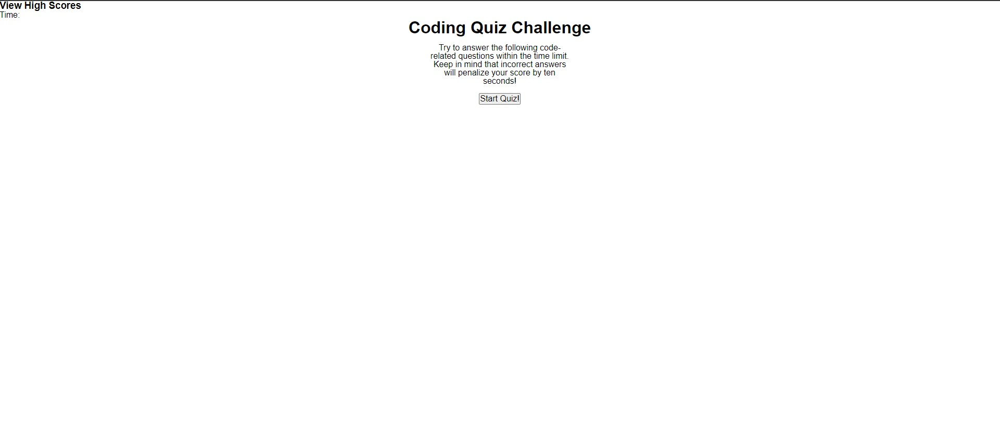

# Coding Quiz Game

## Description
This was designed to be a study guide, both in the finished project of asking questions about coding, and in touching on and using many different subjects that I've learned so far to construct this site. I used jQuery, iterative functions, click events, local storage access, and other techniques to create this page. In the future I plan to add a CSS framework like Bootstrap to make it look a bit nicer.

## Page Preview
Below is what the page should look like:

## Access
This site can be found [here](https://noahcote10.github.io/coding-pop-quiz/).